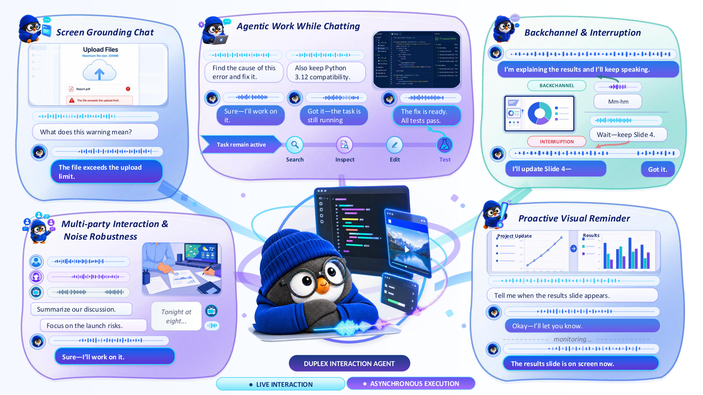
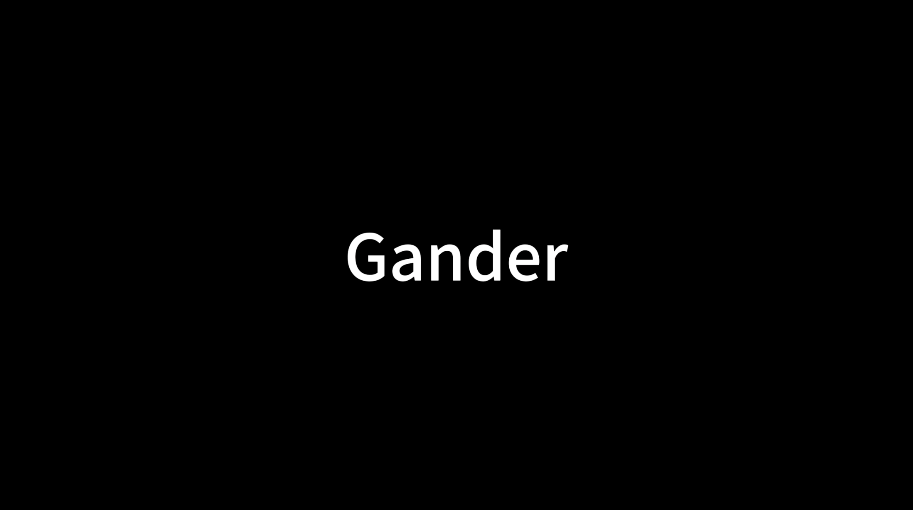
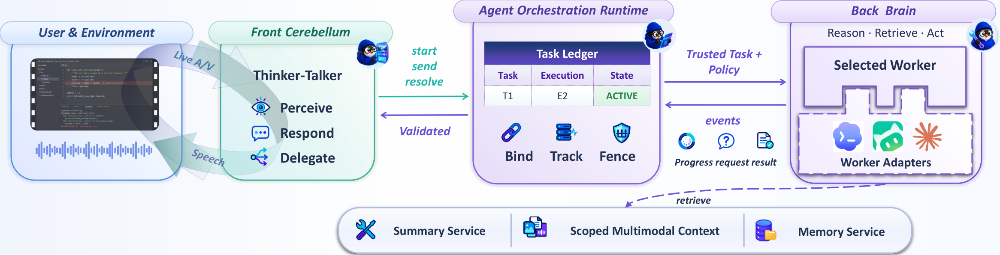
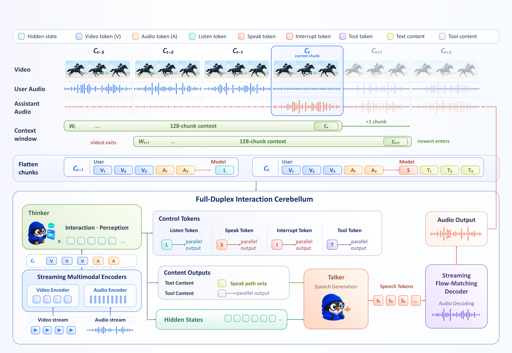
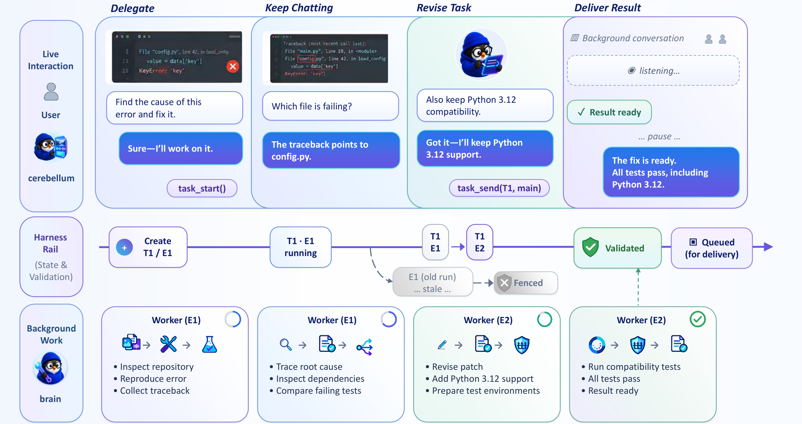
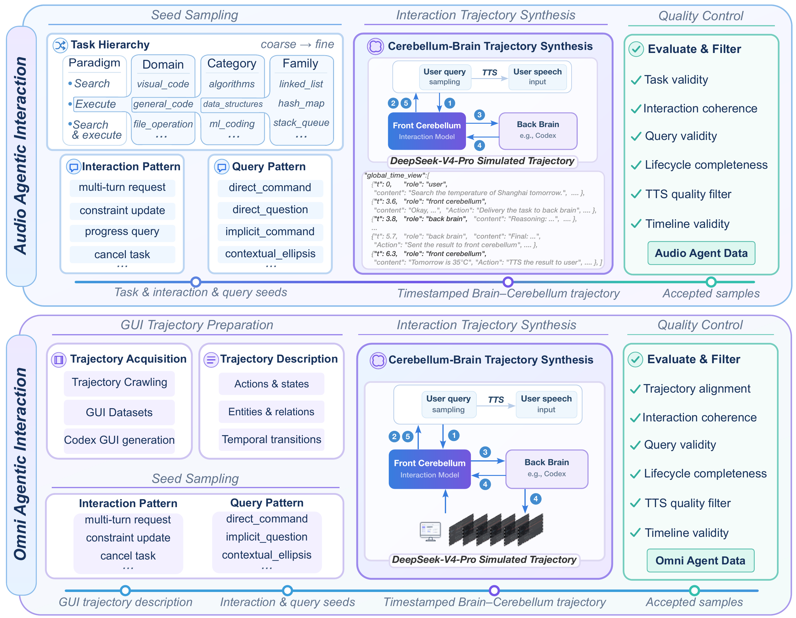

<h1 align="center">Gander: Duplex Interaction Agent Technical Report</h1>

<p align="center">
  <sub>Natural voice interaction, continuous multimodal perception, and long-horizon agentic execution in one system.<strong></sub>
</p>

<p align="center">
  <a href="https://arxiv.org/abs/2609.08977"></a>
  <a href="https://Omni-Interaction-Gander.github.io/Omni-Interaction-Agent"></a>
  <a href="#resources"></a>
  <a href="https://huggingface.co/Gander-Omni/Gander"></a>
</p>

<p align="center">
  
</p>

<p align="center">
  <strong>Talk while it works.</strong><br>
  Interrupt it, redirect it, or show it what you see without stopping the task.
</p>

<p align="center">
  <a href="#news">News</a> ·
  <a href="#demo">Demo</a> ·
  <a href="#system-design">System</a> ·
  <a href="#evaluation">Evaluation</a> ·
  <a href="#quick-start">Quick Start</a> ·
  <a href="#training">Training</a> ·
  <a href="#offline-inference">Inference</a> ·
  <a href="#citation">Citation</a>
</p>

---

<a id="news"></a>

## 📰 News

- **2026-09-10:** The dataset is currently undergoing the open source release process and will be made publicly available soon.
- **2026-09-09:** Gander is officially released.

<a id="overview"></a>

## ✨ Overview

**Gander is an open-source native duplex interaction model with an asynchronous agent loop.** It brings natural voice conversation, continuous multimodal perception, and long-horizon task execution into one live interaction, so users can speak, interrupt, redirect, or share their screen while work continues.

Trained for spoken collaboration, Gander combines **natural, expressive dialogue with knowledge and instruction-following capabilities**. Its **Cerebellum-Brain architecture** pairs a streaming conversational model with an asynchronous reasoning agent, bringing responsive interaction and long-running execution into the same conversation.

- **Natural conversation, learned interaction.** Turn-taking, backchannels, overlap handling, interruption, and proactive responses are learned model behaviors. Gander learns both what to say and when to say it.
- **See and hear as events unfold.** Speech, video, and text share a causal timeline, grounding dialogue in your words, your screen, and the changing scene around you.
- **Keep talking while it works.** Delegate complex tasks and stay involved throughout execution: refine requirements, ask follow-up questions, check progress, grant permissions, or cancel—all through the ongoing conversation.

<a id="demo"></a>

## 🎬 Demo

<p align="center">
  <a href="https://youtu.be/-HFTZaZkfEU">
    
  </a><br>
  <a href="https://youtu.be/-HFTZaZkfEU"><strong>▶ Watch the Gander demo on YouTube</strong></a>
</p>

<a id="system-design"></a>

## 🧠 System Design

<p align="center">
  <br>
  <sub>The Cerebellum owns realtime interaction, the Brain owns long-horizon work, and the runtime connects both on one task timeline.</sub>
</p>

The system separates responsibilities without separating the conversation:

| Module | Implementation | Responsibility |
| --- | --- | --- |
| **Streaming Cerebellum** | `minicpm_ft` | Realtime audio-visual perception, interaction control, text generation, and speech synthesis. |
| **Agent Orchestration Runtime** | `gander_runtime` | Trusted-turn binding, task state, multimodal context, worker events, permissions, and delivery. |
| **Pluggable Back Brain** | Provider interface | Long-horizon reasoning, tool use, file and application operations, and workflow execution. |

A live request follows one causal path:

1. The browser streams microphone audio and optional camera or screen frames.
   Source timestamps align visual evidence with the audio captured at that time.
2. The Cerebellum predicts whether to listen, speak, interrupt, or invoke a task
   operation. Simple requests are answered locally.
3. The runtime binds agentic work to the finalized user turn and starts a tracked
   Brain execution with bounded text and visual context.
4. The Brain works asynchronously. Milestones, questions, permissions, and final
   results return through the same live conversation.

Managed ASR supplies the browser transcript and the trusted text instruction
passed to the Brain; the Cerebellum itself consumes raw audio directly.

### 1. Streaming Cerebellum

<p align="center">
  <br>
  <sub>The Thinker controls interaction and content while the detached Talker renders speech without blocking perception.</sub>
</p>

The Cerebellum starts from MiniCPM-o 4.5 and flattens continuous interaction into
one-second causal units:

```text
[video] [audio] [optional task context] -> [control] [text or tool content]
```

The control token is predicted before content, separating *whether to act* from
*what to produce*.

| Control | Behavior |
| --- | --- |
| `listen` | Stay silent and continue observing the stream. |
| `speak` | Generate a bounded text segment and send it to the Talker. |
| `interrupt` | Stop an utterance that is no longer appropriate, including when the user takes the floor. |
| `tool` | Emit a structured task operation for the runtime. |

On a `speak` unit, the Talker conditions on Thinker hidden states and aligned text
tokens to predict S3 speech tokens. A causal flow-matching decoder renders audio
incrementally. The released alignment is eight text tokens to 50 S3 tokens per
unit, and detached deployment lets perception continue while speech is generated.

For long sessions, the model retains up to 128 recent units. The runtime supports
`context_no_previous`, `context_slate`, and `context_memory`; the release serving
profile uses `context_slate`, which preserves active task state without requiring
a memory model.

### 2. Agent Orchestration Runtime

<p align="center">
  <br>
  <sub>Users can keep talking or revise a task while execution generations prevent stale work from becoming the final answer.</sub>
</p>

The Cerebellum exposes a small task vocabulary. The runtime turns it into a full
execution lifecycle:

| Operation | Meaning |
| --- | --- |
| `task_start` | Create a background task from the current trusted user turn. |
| `task_send` with `main` | Add information or a constraint and steer the primary execution. |
| `task_send` with `fork` | Run a read-only side inquiry without modifying the primary task. |
| `task_resolve` | Cancel a task or answer a permission request. |

Projects, tasks, runs, worker events, and deliveries are tracked separately.
Execution generations fence stale results after a revised objective, while
native event types preserve milestones, multi-question clarification, permission
decisions, stop, reset, and clear as distinct interactions.

### 3. Pluggable Back Brain

The included Brain provider is Codex. Provider construction is registry-based,
so another agent can be integrated without changing the Cerebellum task protocol
or gateway state machine. With `worker.profile: full`, the Brain keeps its native
tool surface and receives Gander-specific interfaces:

| Interface | Purpose |
| --- | --- |
| Provider tools | Use the worker's configured file, shell, retrieval, application, and other tools. |
| `context_fetch` | Retrieve trusted turns, task events, artifacts, and camera or screen frames from the current task lineage. |
| `memory_search` | Retrieve cross-session evidence when an external memory provider is configured. |
| `share` | Return a verified milestone, important finding, or correction while work continues. |
| Native questions and approvals | Ask for missing information or permission and resume the same execution with the user's answer. |

<a id="evaluation"></a>

## 📊 Evaluation

The report evaluates conversational ability, full-duplex interaction,
multimodal understanding, and tool-assisted task execution. Human evaluation
indicates that Gander maintains natural and expressive spoken dialogue. Across
2,052 benchmark utterances, it is evaluated on SpokenQA and VoiceBench under a
full-duplex streaming setting. It reaches 49.62% accuracy on WorldSense and
78.53% on Daily-Omni after full-duplex and agentic post-training.

| Capability | Evaluation | Result |
| --- | --- | ---: |
| Spoken knowledge and QA | SpokenQA, Llama Questions / Web Questions | 75.60 / 59.30 |
| Spoken instruction and dialogue | VoiceBench, AlpacaEval / SD-QA | 3.96 / 5 and 46.84% |
| Interaction timing | Full-Duplex-Bench v3 | 100% appropriate turn-taking; 8.0% premature interruption |
| Tool-assisted execution | Full-Duplex-Bench v3 | 0.759 tool-selection F1; 0.503 argument accuracy; 0.400 strict Pass@1 |
| Audio-visual understanding | WorldSense / Daily-Omni | 49.62% / 78.53% accuracy |

<a id="quick-start"></a>

## 🚀 Quick Start

The following launches the complete browser system: managed ASR, streaming
Thinker, detached Talker, agent runtime, web UI, and a Codex-backed Brain.

### Requirements

| Requirement | Notes |
| --- | --- |
| System | Linux, Conda, and an NVIDIA driver compatible with the CUDA 12.4 PyTorch stack. |
| GPUs | The release profile uses three physical GPUs, one each for Thinker, Talker, and ASR. |
| Models | MiniCPM-o 4.5, a matching Gander Thinker/Talker pair, and faster-whisper large-v3. |
| Brain | An authenticated Codex CLI or compatible executable supporting `app-server --stdio`. |

### 1. Install the repository

```bash
git clone https://github.com/Omni-Interaction-Gander/Omni-Interaction-Agent.git
cd Omni-Interaction-Agent

conda env create -f environment.yml
conda activate gander
```

### 2. Install the Brain

Install [Codex CLI](https://learn.chatgpt.com/docs/codex/cli) on the serving
machine, then run it once to complete sign-in:

```bash
curl -fsSL https://chatgpt.com/codex/install.sh | sh
codex
```

After sign-in, verify that `codex app-server --help` succeeds. Gander starts and
manages the app server itself.

### 3. Download model weights

```bash
mkdir -p checkpoints

hf download openbmb/MiniCPM-o-4_5 \
  --local-dir checkpoints/MiniCPM-o-4_5
hf download Gander-Omni/Gander \
  --local-dir checkpoints/Gander
hf download Systran/faster-whisper-large-v3 \
  --local-dir checkpoints/faster-whisper-large-v3
```

Existing local copies work as well. Select the matching Thinker and Talker pair
listed on the [Gander model page](https://huggingface.co/Gander-Omni/Gander).

### 4. Configure the service

```bash
cp gander_runtime/configs/serve.example.yaml \
  gander_runtime/configs/serve.local.yaml
mkdir -p workspace
```

Replace the path placeholders in `serve.local.yaml` with absolute paths:

| Asset | Configuration fields |
| --- | --- |
| MiniCPM-o 4.5 | `model.model_name_or_path`, `model.processor_name_or_path`, `model.token2wav_dir`, and `duplex.ref_audio_path` |
| Gander | `duplex.checkpoint` and `duplex.talker_checkpoint` |
| Managed ASR | `asr.model_path` |
| Brain | `worker.settings.codex_bin`; use `codex_home` only for a separate authenticated home |

The Brain configuration is compact:

```yaml
worker:
  provider: codex
  cwd: ../workspace
  profile: full
  settings:
    codex_bin: codex
    model: null
    reasoning_effort: medium
    codex_home: null
```

`cwd` is the workspace available to the Brain. `codex_bin` may be a command on
`PATH` or an absolute path, and `model: null` keeps the Codex default model.

The release template already sets 8/50 token alignment, `context_slate`, full
Brain tools, and the three-GPU mapping: GPU 0 for Thinker, GPU 1 for Talker, and
GPU 2 for ASR.

### 5. Validate and launch

```bash
./scripts/serve.sh --check-config
./scripts/serve.sh
```

`--check-config` validates the service without loading model weights. Open
`http://127.0.0.1:8000` after launch; `/health` and `/api/asr/health` report
runtime and ASR readiness. For remote access, proxy both HTTP and WebSocket
routes through HTTPS so browser media permissions work normally.

<a id="training"></a>

## 🧪 Training

Training uses one entry point and layered YAML configuration. `scripts/train.sh`
loads `minicpm_ft/configs/train.yaml`, applies supplied dataset or experiment
YAMLs in order, and applies dotted command-line overrides last.

### Data and train-serve alignment

<p align="center">
  <br>
  <sub>Training examples preserve the causal unit timeline and task lifecycle used by the deployed system.</sub>
</p>

Gander is trained on a 2.7M-example mixture:

| Data family | Scale | Main supervision |
| --- | ---: | --- |
| Speech interaction | 1.01M | Spoken dialogue and QA, InteractionSpeech, interruption, backchannels, and simultaneous translation. |
| Audio-visual interaction | 1.10M | Streaming video QA, narration, temporal grounding, and proactive visual responses. |
| Agentic interaction | 359.6K | Delegation, steering, progress, clarification, permissions, cancellation, GUI trajectories, and tool reasoning. |
| Robustness and negatives | 229.7K | Irrelevant video, no-command environments, interference, overlapping distractors, and multi-party tracking. |

Training and serving share three core contracts:

- Inputs and outputs use the same one-second causal units, with visual evidence
  selected by source time.
- Long-context training retains up to 128 prior units and 1,500 previous-context
  tokens; examples beyond the 16,384-token limit are filtered rather than
  truncated.
- Acoustic augmentation preserves the interaction timeline while adding noise,
  babble, transients, device coloration, room response, echo, or idle periods.

The released recipe uses two stages:

| Stage | Trainable modules | Objective |
| --- | --- | --- |
| **Thinker** | LLM and audio projection | Text, interaction-control, and structured tool-call tokens. |
| **Talker** | TTS projection and decoder; Thinker frozen | Time-aligned S3 speech tokens conditioned on Thinker hidden states. |

A joint mode remains available for experiments; the released checkpoint recipe
and composition follow the two-stage path above.

### Validate the bundled examples

The repository includes 12 Thinker and 6 Talker examples with local media for a
small end-to-end data-path check:

```bash
./scripts/prepare_data.sh check \
  minicpm_ft/examples/release/thinker/train_config.yaml
./scripts/prepare_data.sh check \
  minicpm_ft/examples/release/talker/train_config.yaml
```

### Train the Thinker

```bash
BASE=/absolute/path/to/MiniCPM-o-4_5

./scripts/train.sh minicpm_ft/examples/release/thinker/train_config.yaml \
  --model.model_name_or_path "$BASE" \
  --model.processor_name_or_path "$BASE" \
  --launch.gpus_per_node 1 \
  --train.output_dir outputs/thinker
```

Thinker mode trains the LLM and audio projection while keeping the vision tower,
resampler, and TTS modules frozen. The default objective combines text loss with
an interaction-control loss weighted by 1.5.

### Train the Talker

```bash
BASE=/absolute/path/to/MiniCPM-o-4_5
THINKER=/absolute/path/to/thinker-checkpoint

./scripts/train.sh minicpm_ft/examples/release/talker/train_config.yaml \
  --model.model_name_or_path "$BASE" \
  --model.processor_name_or_path "$BASE" \
  --runtime.init_checkpoint "$THINKER" \
  --launch.gpus_per_node 1 \
  --train.output_dir outputs/talker
```

Talker mode freezes the completed Thinker's LLM and audio projection, and trains
only the TTS projection and decoder. Bundled examples contain S3 targets. For a
dataset without inline `turn.meta.s3_codes`, set `data.s3_cache_dir` in its
training YAML and build the cache first:

```bash
./scripts/prepare_data.sh s3 /path/to/release/train_config.yaml --device cuda:0
```

Both stages default to `save_trainable_only: true`. At deployment, the Thinker is
composed on top of MiniCPM-o 4.5, then the Talker is composed on top of that
Thinker. Neither checkpoint duplicates frozen base-model parameters.

### Use a full dataset release

Create an overlay YAML with `data.release_root`, ordered manifest lists, and row
counts or sampling weights. Relative media paths resolve below the release root.
Enable `audio_augment` and provide the noise/RIR indices when using acoustic
augmentation.

Multi-node execution uses `launch.hosts` or `launch.hostfile`. Inspect the fully
merged recipe before a large run:

```bash
./scripts/train.sh /path/to/release/train_config.yaml --show-config
```

<a id="offline-inference"></a>

## 🔍 Offline Inference

One entry point covers two distinct paths:

| Mode | Input and behavior |
| --- | --- |
| `turn` | A bounded text, audio, image, or combined input followed by one generated response. |
| `duplex` | Audio consumed in online one-second units, producing per-unit control decisions, incremental text, tool traces, and optional speech. |

Start from the release profile. Set `model.model_name_or_path`,
`model.processor_name_or_path`, `inference.checkpoint`, and the fields below
`inference.input`, then run it:

```bash
cp minicpm_ft/configs/infer.yaml /tmp/gander-infer.yaml
./scripts/infer.sh /tmp/gander-infer.yaml
```

For turn-based inference, keep `inference.mode: turn` and set any supported
combination of `input.text`, `input.audio`, and `input.image`.

For chunk-wise duplex inference, use the released streaming values:

```yaml
inference:
  mode: duplex
  checkpoint: /path/to/gander-thinker-checkpoint
  input:
    text: null
    audio: /path/to/input.wav
    image: null
  duplex:
    chunk_ms: 1000
    speak_text_tokens_per_unit: 8
    talker_speech_tokens_per_unit: 50
    sliding_window_mode: context_slate
    context_previous_max_tokens: 1500
```

To generate speech, also configure the Talker and reference audio:

```yaml
model:
  init_tts: true
  token2wav_dir: /path/to/MiniCPM-o-4_5/assets/token2wav

inference:
  talker_checkpoint: /path/to/gander-talker-checkpoint
  generate_audio: true
  output_audio: /path/to/output.wav
  input:
    audio: /path/to/input.wav
    ref_audio: /path/to/reference.wav
```

Turn mode measures a bounded multimodal response. Duplex mode exercises the same
incremental control and context behavior used by the realtime Cerebellum.

<a id="configuration-reference"></a>

## ⚙️ Configuration Reference

The main deployment choices live in the serving YAML:

| Setting | Options |
| --- | --- |
| `server.mode` | `lean` uses the shortest trusted task path; `coordinator` adds a planning and supervision layer. |
| `duplex.media_mode` | `voice` starts with audio, `omni` requires visual input, and `auto` permits client selection. |
| `duplex.allow_client_video` | Independently enables camera and screen attachment. |
| `duplex.sliding_window_mode` | Selects `context_no_previous`, `context_slate`, or `context_memory`. |
| `worker.provider` / `worker.profile` | Selects a registered Brain backend and its task-scoped or full tool surface. |
| `asr.mode` | Runs managed ASR, connects to an external service, or disables transcription. |

<a id="repository-layout"></a>

## 📁 Repository Layout

| Path | Contents |
| --- | --- |
| `minicpm_ft/mcpmft/data/` | Manifest loading, media resolution, augmentation, temporal serialization, collation, and S3 targets. |
| `minicpm_ft/mcpmft/modeling/` | Model loading, trainable-module selection, multimodal forward path, and streaming acoustic features. |
| `minicpm_ft/mcpmft/infer/` | Turn-based and chunk-wise inference, context windows, detached Talker, ASR, and browser client. |
| `gander_runtime/gander_runtime/` | Realtime transport, media timeline, task gateway, ledger, context routing, worker events, and supervision. |
| `gander_runtime/gander_runtime/providers/` | Typed Brain provider registry, capabilities, factory, and Codex adapter. |
| `minicpm_ft/examples/release/` | Self-contained Thinker and Talker examples with local media. |
| `scripts/` | Stable entry points for data validation, training, offline inference, and serving. |
| `docs/` | Paper and selected system figures. |

<a id="resources"></a>

## 🔗 Resources

| Resource | Link |
| --- | --- |
| Paper | [arXiv:2609.08977](https://arxiv.org/abs/2609.08977) · [PDF](docs/Duplex_Interaction_Agent_Technical_Report.pdf) |
| Model | [Gander-Omni/Gander](https://huggingface.co/Gander-Omni/Gander) |
| Dataset | Coming soon |
| Demo | [Project page](https://Omni-Interaction-Gander.github.io/Omni-Interaction-Agent) · [YouTube](https://youtu.be/-HFTZaZkfEU) |

<a id="citation"></a>

## 📝 Citation

If you find Gander useful in your research, please cite:

```bibtex
@misc{orantqing2026omniinteractionagenttechnical,
      title={Omni Interaction Agent Technical Report}, 
      author={Orantqing and Shengpeng Ji and Junlong Tong and Jialong Zuo and Dongjie Fu and Di Cao and Yangzhuo Li and Shangda Wu and Franz and Evan and Theron Veyra and Changhao Pan and Jingyu Lu and Dongchao Yang and Zhifei Xie and Yang Tan and Xiaoyu Shen and Xiaoda Yang and Wenfu Wang and Teddy Sun and Steve Yves and Zhou Zhao},
      year={2026},
      eprint={2609.08977},
      archivePrefix={arXiv},
      primaryClass={eess.AS},
      url={https://arxiv.org/abs/2609.08977}, 
}
```

<a id="license"></a>

## 📄 License

The code in this repository is released under the [Apache License 2.0](LICENSE).
